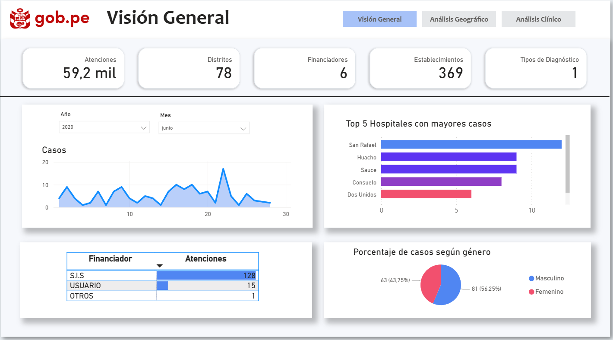
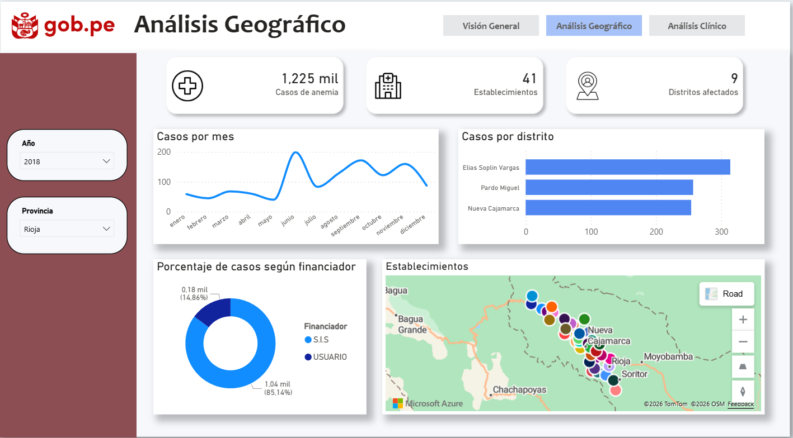
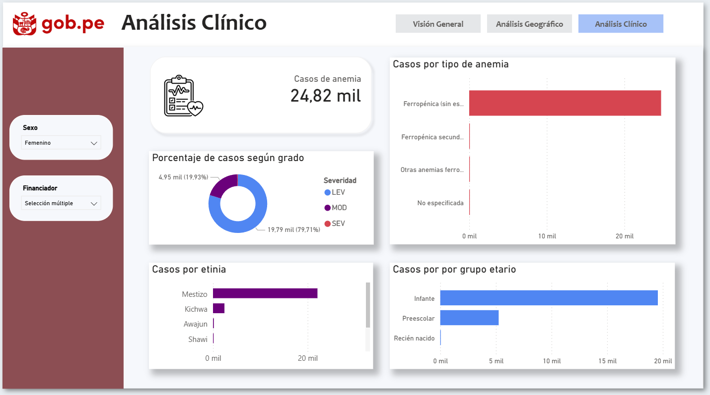

# Anemia en San Martín
En este proyecto se busca aplicar buenas prácticas para distribuir data a partir de un dataset otorgado por el Gobierno del Perú con el fin de analizar y consultar la información de manera adecuada.

## Dashboard:
Link del dashboard realizado en PowerBI:
<https://app.powerbi.com/view?r=eyJrIjoiNjYzOTljNWMtNDQ0Yi00YTBlLWExMDAtMWJlNjFhMTk1YjM3IiwidCI6IjBlMGNiMDYwLTA5YWQtNDlmNS1hMDA1LTY4YjliNDlhYTFmNiIsImMiOjR9&pageName=885574203bb50b71081c>

#### Objetivos:
1. Distribuir el dataset en tablas y establecer relaciones entre ellas.
2. Identificar los indicadores más relevantes para el estudio de la Anemia en el departamente de San Martín.
3. Visualizar información general y específica sobre el análisis clínico y geográfico de cada atención.

#### Tecnologías utilizadas:
- SQL Server
- Power BI

#### Workflow (ETL):

##### Extract:
- Se descargar el dataset (CSV) del portal <https://www.datosabiertos.gob.pe/>

##### Transform & Load:
- Se verifica que los datos estén limpios.
- Se procede a realizar la normalización separando la información por tablas, creando claves primarias y foráneas y estableciendo relaciones entre ellas.

##### Load:
- Todos los datos se cargan a la base de datos AnemiaSanMartin en SQL Server.
- Se realiza la conexión del modelo relacional con Power BI.

#### Database:

Tras normalizar las tablas en SQL Server, obtenemos la siguientes tablas y relaciones:

Finalmente, se utiliza PowerBI como herramienta para la visualización de data relevante.

#### KPIs:
##### Visión General:
- Total de atenciones registradas por anemia.
- Cantidad de distritos afectados.
- Número de establecimientos de salud involucrados.
- Número de financiadores.
- Distribución de casos por género.
- Evolución diaria de casos según el periodo seleccionado.
- Top 5 establecimientos de salud con mayor número de casos.

##### Análisis Geográfico:
- Filtro por año y provincia.
- Total de casos de anemia por periodo seleccionado.
- Número de establecimientos y distritos afectados.
- Evolución mensual de casos.
- Distribución de casos por distrito.
- Distribución porcentual de casos según tipo de financiador.
- Visualización geográfica de establecimientos de salud en mapa.

##### Análisis Clínico:
- Filtro por sexo y financiador.
- Total de casos de anemia registrados.
- Distribución de casos según grado de severidad (leve, moderada, severa).
- Casos por tipo de anemia.
- Distribución de casos por grupo etario.
- Distribución de casos según etnia.

#### Resultado final:

##### Vision general:

##### Análisis geográfico:

##### Análisis clínico:

#### Conclusiones:
- El proceso de normalización permitió estructurar la información de manera eficiente y escalable.
- El uso de un modelo relacional facilitó el análisis multidimensional en Power BI.
- En la región de San Martín, un total de 369 establecimientos de salud registran atenciones relacionadas con la anemia.
- En la gran mayoría de las atenciones, el financiador corresponde al Seguro Integral de Salud (SIS).
- En todas las provincias analizadas existe más de un establecimiento de salud que brinda atención por esta enfermedad.
- El grado de anemia más frecuente es el leve, mientras que el menos frecuente es el severo.
- El grupo etario más afectado por la anemia corresponde a infantes entre 1 y 2 años de edad.
- La etnia predominante entre los casos registrados es la mestiza.
